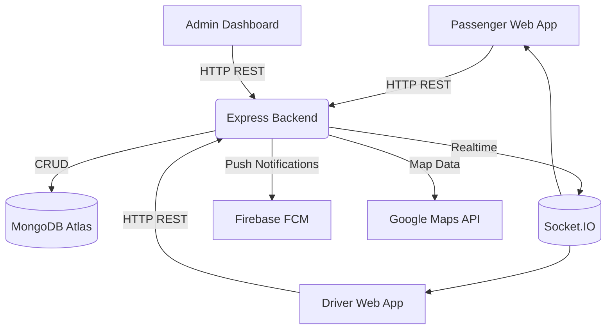

# Van Queue & Departure System – System Design & Architecture

## 1. Overview

The **Van Queue & Departure System** is a full-stack web application designed to digitalize and streamline the queuing, ticket booking, and vehicle tracking process for passenger vans operating between Thammasat University and main Bangkok transport hubs.  

This document provides an in-depth overview of the **system architecture**, **component relationships**, and **communication flows** between the client, backend, and external services.

---

## 2. System Architecture Layers

### 🟦 Client Layer
**Actors:**
- **Passenger**
  - Register / Login
  - Create or reserve queue tickets
  - Upload payment slips
  - View van route and real-time tracking
  - View booking history and Lost & Found board
- **Driver**
  - Verify payment slips
  - Manage queues manually
  - Confirm departure (“Van Departed”)
  - Post Lost & Found items
- **Admin**
  - Manage vans, drivers, and routes
  - Configure queue rules and cutoff times
  - Generate system reports

**Technology:**  
- React + Vite + TailwindCSS  
- React Router for navigation  
- Axios for API communication  
- Socket.IO Client for real-time updates  
- Firebase SDK for push notifications  

---

### 🟩 Application Layer
**Backend Framework:** Node.js + Express.js  

**Responsibilities:**
- RESTful API endpoints for Passenger / Driver / Admin
- Authentication (JWT-based)
- Authorization (Role-based middleware)
- Real-time queue synchronization via Socket.IO
- Event-triggered push notifications (FCM)
- Connection to MongoDB database

**Key modules:**

/src
├── controllers/ # Business logic
├── routes/ # API endpoints
├── models/ # MongoDB schemas
├── middleware/ # Auth, validation
├── services/ # External APIs (FCM, Maps)
├── config/
└── app.js

---

### 🟧 External Services

| Service | Purpose |
|----------|----------|
| **Google Maps API** | Display van routes, calculate distance and ETA |
| **Firebase Cloud Messaging (FCM)** | Send notifications for payment verified, upcoming departure, and van departure |

---

### 🟥 Data Layer

| Component | Description |
|------------|-------------|
| **MongoDB Atlas** | Main NoSQL database hosting all collections: Passenger, Driver, Van, Route, TripInstance, Queue, Payment, TicketHistory, LocationUpdate |
| **File Storage (Cloud)** | Store uploaded payment slips and optional images for lost & found |

---

## 3. High-Level System Diagram

## 4. Component Interaction
### 4.1 Frontend ↔ Backend

All communication uses HTTPS + JSON.

Socket.IO handles:

Queue status updates

Departure confirmation broadcast

Countdown reminder before departure

### 4.2 Backend ↔ External Services

Google Maps API: used for trip visualization and distance/time estimation.

FCM: used to push notifications to passengers/drivers at key events (payment verified, upcoming departure).

## 5. Sequence Diagrams
### 5.1 Passenger – Reserve Queue Flow
sequenceDiagram
  participant P as Passenger
  participant FE as React Frontend
  participant BE as Express Backend
  participant DB as MongoDB
  participant FCM as Firebase FCM

  P->>FE: Choose route & trip, upload payment slip
  FE->>BE: POST /api/queue/reserve
  BE->>DB: Insert Queue + Payment Document
  DB-->>BE: Return queue_id and trip info
  BE->>FCM: Send "Reservation Confirmed"
  BE-->>FE: 200 OK + Ticket Info
  FE-->>P: Show ticket and check-in countdown

### 5.2 Driver – Confirm Departure Flow
sequenceDiagram
  participant D as Driver
  participant FE as Driver App
  participant BE as Express Backend
  participant DB as MongoDB
  participant FCM as Firebase FCM

  D->>FE: Press "Depart Now"
  FE->>BE: PATCH /api/driver/departure/:tripId
  BE->>DB: Update Trip status = departed
  BE->>FCM: Push "Van Departed" to all passengers in trip
  DB-->>BE: OK
  BE-->>FE: 200 OK (Confirmed)
  FE-->>D: Show success message

## 6. Deployment Overview
graph LR
  FE[React App (Vercel)] -->|HTTPS| BE[Express API (Render)]
  BE --> DB[(MongoDB Atlas)]
  BE --> FCM[Firebase Cloud Messaging]
  BE --> MAPS[Google Maps API]

| Component     | Recommended Service |
| ------------- | ------------------- |
| Frontend      | Vercel              |
| Backend       | Render / Railway    |
| Database      | MongoDB Atlas       |
| Notifications | Firebase FCM        |

The MVP deployment targets a single backend instance and one database cluster.
No load-balancing or container orchestration is required at this stage.

## 7. Security Considerations

Authentication: JWT (JSON Web Token) for all API requests.

Password Storage: bcrypt hashing.

Role Authorization: Middleware guards (Passenger, Driver, Admin).

Validation: Joi/Zod for payload validation.

CORS: Restricted to production domains.

Environment Config: Secrets stored in .env, example file provided.

## 8. Summary
| Layer       | Purpose                                           | Core Technology                |
| ----------- | ------------------------------------------------- | ------------------------------ |
| Client      | Web interface for passengers, drivers, and admins | React + Vite + Tailwind        |
| Application | Handles API, authentication, real-time updates    | Node.js + Express + Socket.IO  |
| External    | Third-party APIs for maps and notifications       | Google Maps API / Firebase FCM |
| Data        | Persistent storage for all operational data       | MongoDB Atlas                  |
